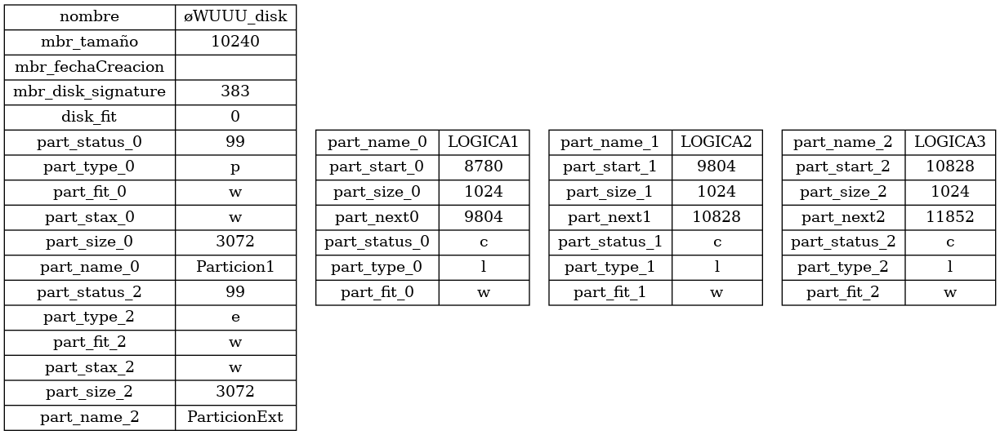
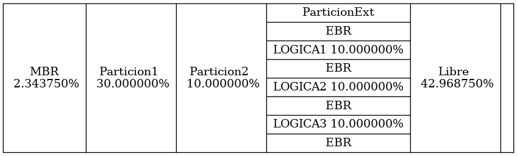

# MIA_PY1
Proyecto 1 de Manejo e implementaciòn de Archivos. Sistema de archivos Ext3
Este proyecto es desarrollado en VSCode 1.58.2 en un sistema operativo GNU/Linux Ubuntu 20.04.2.0 LTS
Lenguaje C++

La aplicación será totalmente en consola, a excepción de los
reportes en Graphviz. Esta no tendrá menús, sino que se
utilizarán comandos. No distinguirá entre mayúsculas y
minúsculas. La aplicación será capaz de leer desde standard
input(stdin) y escribir a standard output (stdout) de ser
necesario. Hay parámetros obligatorios y opcionales. Solo se
puede colocar un comando por línea.

## Ejecuciòn 
Para la ejecuciòn del programa debemos compilar el codigo en C++( Debes tener un compilador, en este caso se utilizo g++) y generara un archivo sin extension, este lo podemos ejecutar desde la terminal haciendo un ./main
Oprimiendo "?" nos desplegara una lista de comandos permitidos dentro del Sistema.

## Exec 
Este comando ejecuta una archivo de entrada para ejecutar multiples comandos.

## mkdisk
El comando mkdisk crea una simulacion de disco como un archivo binario y asi poder escribir sobre ella archivos de cualquier tipo.

## RMDISK
Este parámetro elimina un archivo que representa a un disco
duro mostrando un mensaje de confirmación para eliminar

## Fdisk
Este comando administra las particiones en el archivo que
representa al disco duro. Deberá mostrar un error si no se
pudo realizar la operación solicitada sobre la partición,
especificando por qué razón no pudo crearse (Por espacio, por
restricciones de particiones, etc.).
No se considerará el caso de que se pongan parámetros
incompatibles, por ejemplo, en un mismo comando fdisk
llamar a delete y add.

## MOUNT
Este comando montará una partición del disco en el sistema
e imprimira en consola un resumen de todas las particiones
montadas actualmente

## Unmount 
Desmonta una partición del sistema. Se utilizará el id que
se le asignó a la partición al momento de cargarla

## REP
Recibirá el nombre del reporte que se desea y lo generará con graphviz
en una carpeta existente, son reportes mbr y de disco los existentes

## REPORTE MBR
Mostrará tablas con toda la información del MBR, así como de
los EBR que se pudieron haber creado

## REPORTE DISK

Este reporte mostrará la estructura de las particiones, el mbr del
disco y el porcentaje que cada partición o espacio libre tiene dentro
del disco (La sumatoria de los porcentajes debe de ser 100%).
A continuacion se muestran un ejemplo de los reporetes 

### Ejemplo de archivo de entrada

rmdisk -path=discos/disco3.disk

mkdisk -path=discos/disco3.disk -size=10 -f=ff -u=k

fdisk -size=3 -path=discos/disco3.disk -name=Particion1 

fdisk -size=1 -path=discos/disco3.disk -name=Particion2 

fdisk -size=3 -path=discos/disco3.disk -name=ParticionExt -type=e

fdisk -size=1 -path=discos/disco3.disk -name=LOGICA1 -type=l

fdisk -size=1 -path=discos/disco3.disk -name=LOGICA2 -type=l

fdisk -size=1 -path=discos/disco3.disk -name=LOGICA3 -type=l

mount -path=discos/disco3.disk -name=Particion2

fdisk -path=discos/disco3.disk -name=ParticionExt -delete=full

rep -id=440A -name=mbr -path=discos/rep.png

pausa

fdisk -add=500 -u=K -path=discos/disco3.disk -name=Particion2 

rep -id=440A -name=mbr -path=discos/rep.

